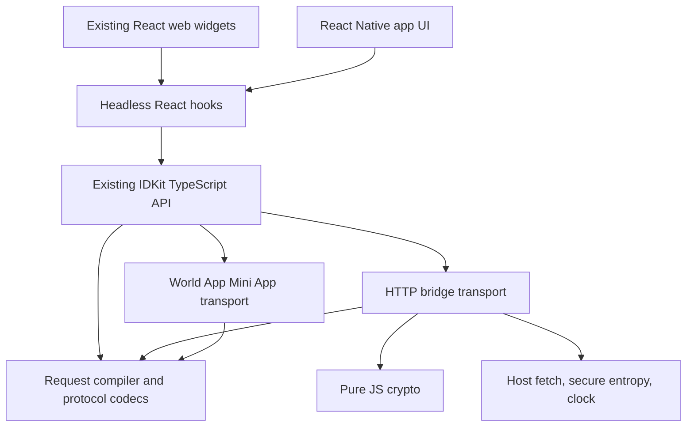

**Pure JavaScript SDK migration: architecture and compatibility contract**

Planning baseline: 2026-09-12, commit `f20fea549625f981a853c39fc2ac26dec14f6663`, verified against the remote default branch. The lockfile resolves `world-id-primitives` 0.14.0. The architecture below was approved before implementation.

The recommendation is to replace the engine underneath the existing TypeScript API, retain the React hooks and web widgets, and add a portable hooks entry. Rust remains the reference implementation for protocol behavior and the implementation used by native SDKs. JavaScript consumers, builds, tests, and npm artifacts should no longer need WASM. Native Rust is needed only in the separate conformance CI job and when deliberately refreshing its fixtures.

The agreed shipping strategy retains the current native Rust runner and explicit JavaScript API tests in this repository. A separate compatibility repository or maintained WASM SDK is not required. The [ship plan](pure-js-sdk-release.md) is the current checklist for remaining work, PR boundaries, candidate qualification, and release order; it supersedes the original sequencing below.

Tests cannot prove that two implementations will never diverge for every possible input. The practical guarantee should be that compatibility is an enforced merge and release condition: current Rust behavior is executed on every PR, existing contracts remain covered, and intentional differences require an explicit decision.

The proposed initial React Native scope is core plus headless hooks, with application-owned UI and deep linking. Native verification widgets would be a separate UI workstream unless included explicitly.

**Implementation status**

The core now uses the TypeScript protocol compiler and encrypted HTTP bridge. The
Mini App transport calls the same compiler. Public declarations are independent
of WASM, and ordinary JavaScript builds and tests do not invoke Rust. React web
widgets remain available; `@worldcoin/idkit/hooks` imports without React DOM.
Explicit Node entries supply entropy without changing global crypto. Other hosts
can supply secure entropy and fetch through `configureIDKitRuntime`.

Runtime dependencies added: `@noble/ciphers` 1.3.0 (AES-GCM), `@scure/base` 1.2.6
(base64), `@stablelib/utf8` 1.0.2 (portable UTF8), and `whatwg-url` 14.2.0 (URL/IDNA
parsing). The existing Noble hashes and signing dependencies remain. Crypto
primitives receive bytes, avoiding platform codec requirements. A build adapter
replaces only the URL parser's codec module with the SDK's portable codecs; it
requires no application aliases or global polyfills. Keeping full IDNA behavior
adds bundle size, so parser/version changes require compatibility testing.

The native runner exposes production Rust behavior as JSONL. Checked-in vectors
keep ordinary tests Rust-free; live CI compares current Rust, the retained corpus,
the type manifest and generated inputs. A local HTTP bridge compares actual
creation, encryption, retries and session requests. Release workflows require
these checks plus packed Node consumers, Chromium, workerd and the Hermes corpus.
Fixtures are deliberately refreshed and reviewed; CI never updates them silently.

Raw bridge JSON also retains duplicate-field, integer-spelling and UTF8 provenance.
Typed fields follow Rust's rejection rules while ignored extensions remain ignored;
wrapped protocol responses preserve Rust's deliberate last-value handling of duplicates.
Real Fetch responses use their byte body. Custom fetch adapters that provide only
`text()` or `json()` have already discarded some source information, so those
adapters cannot preserve malformed-byte or duplicate-field behavior completely.

Earlier local validation included Node 18 and 24 ESM/CommonJS package consumers,
Chromium ESM/IIFE with WebAssembly absent, workerd without Node compatibility,
and the RN 0.79.2 Hermes engine. These are runtime/protocol checks using synthetic
requests. Full Metro builds, physical Android/iOS handoff and live relying-party
verification remain release acceptance steps; see
[the release checklist](pure-js-sdk-release.md) and
[the device smoke example](../js/examples/react-native-smoke/README.md).
No package versions have been published by this implementation. These earlier
checks do not qualify a new PR head or final release artifact; rerun the applicable
gates after staging the PRs and preparing release versions and dependency pins.

The sections below retain the approved planning rationale and original sequencing.

**What actually needs replacing**

| Existing area                                                                                                               | Migration                                                                                                                                                                                                 |
| --------------------------------------------------------------------------------------------------------------------------- | --------------------------------------------------------------------------------------------------------------------------------------------------------------------------------------------------------- |
| TypeScript builders, preset helpers, request handles and outer polling loop                                                 | Preserve public API and observable behavior; replace their calls into WASM.                                                                                                                               |
| Rust request compilation, preset expansion, constraints, bridge HTTP, AES-GCM, invite-code derivation and result conversion | Implement in small TypeScript modules, each covered by the native Rust runner.                                                                                                                            |
| World App Mini App transport                                                                                                | Keep postMessage and response subscription logic; replace WASM payload compilation and result conversion. This transport is a World App WebView integration, distinct from React Native.                  |
| Hashing, RP signing and session commitment extraction                                                                       | Already JavaScript; retain implementations, expand parity coverage and remove platform import side effects.                                                                                               |
| React hooks and web widgets                                                                                                 | Retain logic and callback contracts. Add a DOM-free hooks entry and make the React DOM peer optional for hooks consumers.                                                                                 |
| Types exported through generated WASM declarations                                                                          | Move to standalone TypeScript declarations, with contract coverage independent of WASM. The existing custom TypeScript sections are handwritten, so their current placement alone does not prevent drift. |
| Build/test/release configuration                                                                                            | Remove WASM loading, copying, initialization, wasm-pack and server-test imports of WASM; preserve ESM, CommonJS and browser script builds.                                                                |

At the planning baseline, entry points were in `js/packages/core/src/request.ts` and `js/packages/react/src/index.ts`. Both bridge and Mini App flows initialized WASM. The core root also reaches `@worldcoin/idkit-server`, whose signing module could execute `require("node:crypto")` at import time. Removing WASM without fixing that import path will leave a React Native blocker.

**Compatibility strategy**

Create a small native `idkit-conformance` executable in this repository. It accepts JSON Lines operations and returns either a value or a structured failure. Use the existing native `rp-sign-vectors` CLI and Go/Rust parity CI as the precedent. Build it with the committed `Cargo.lock` and record the Rust revision, protocol dependency version, fixture format version and corpus seed in results.

The executable must call production Rust code. Expose narrow internal helpers where necessary: some preset/default logic currently lives behind WASM features, and the claims-aware result converter and bridge response parser are private. Move those helpers into shared Rust modules without changing behavior. A second Rust implementation written just for tests would provide misleading confidence.

Use explicit test inputs for keys, IVs, generated IDs and time. Production JavaScript always obtains entropy from a secure host source; deterministic providers belong in tests. Avoid making fixtures depend on the incidental order in which an implementation consumes random bytes.

| Layer                                      | What runs                                                                                                 | What it catches                                                                                           |
| ------------------------------------------ | --------------------------------------------------------------------------------------------------------- | --------------------------------------------------------------------------------------------------------- |
| Retained regression corpus                 | Checked-in inputs and Rust-derived expected results, runnable with JavaScript tooling alone               | Previously supported behavior changing; historical failure cases recurring.                               |
| Live differential suite                    | Current native Rust and current JS execute identical deterministic and seeded generated cases on every PR | Rust or JS changing while stale fixtures still pass.                                                      |
| Stateful transport transcripts             | Both engines communicate with a local synthetic bridge using the same response schedule                   | Wrong paths/body shapes, state transitions, retries, expiry and public error behavior.                    |
| Public JavaScript and React contract tests | Existing tests plus declaration/API checks and lifecycle cases                                            | Differences introduced by the old WASM adapter, wrapper defaults, error mapping or React callbacks.       |
| Packed runtime matrix                      | Install npm tarballs into small Node, browser, edge and React Native consumers                            | Packaging, import resolution, engine features, hidden platform dependencies and actual runtime execution. |

Preserve historical JavaScript boundary behavior through explicit public API tests and characterized fixtures. The agreed plan does not require a new WASM comparator or maintaining the former SDK for future features. Consumers should never ship two engines or select between them at runtime.

Comparison rules matter:

- Compare hash output, KDF output, binary proof encodings and AES ciphertext/tag bytes exactly. Test Rust encrypt → JS decrypt and JS encrypt → Rust decrypt, including wrong keys, IVs, altered tags and malformed encodings.
- Compare request/result JSON structurally, preserving omitted versus null fields, array order, string versus number types, and exact cryptographic strings. Object key order is not generally a wire requirement; do not introduce a protocol-wide canonical JSON format just to match ciphertext produced from different key orderings.
- For raw AES vectors, feed identical plaintext bytes. For whole encrypted requests, decrypt each output and compare the required payload semantics. Assert exact serialization where the protocol actually signs or otherwise requires it.
- Preserve integers losslessly in the reference runner envelope, using explicit decimal-string representations for wide integers. Do not parse a Rust u64 into a JavaScript number in the test harness and silently hide precision loss. Exercise the actual JS/WASM public conversion behavior separately before deciding how to handle values beyond the existing public number range.
- Compare success/failure, exposed error code, throw versus returned status, and meaningful timing boundaries. Do not require identical HTTP-library diagnostic prose. React currently maps some Rust message substrings to codes, so those mappings need explicit tests or an internal structured-error replacement.
- Normalize only named, genuinely nondeterministic metadata. Never strip claims, proof bytes, signal hashes, session references, error precedence or integrity metadata to make tests pass.

Seed the corpus from current Rust tests, then cover the following matrix:

| Area                   | Required cases                                                                                                                                                                                                                             |
| ---------------------- | ------------------------------------------------------------------------------------------------------------------------------------------------------------------------------------------------------------------------------------------ |
| Requests               | Every preset; every credential; nested any/all/enumerate; singleton and empty operators; repeated credential identifiers and their signal behavior; creation, session creation and session proof.                                          |
| Defaults and wire data | Environments and bridge overrides; package metadata; action description; blank/missing values; native v1/v2 and bridge payloads; timestamp presence; legacy-proof flags; `return_to` and percent encoding.                                 |
| Signals and actions    | Empty, Unicode, bytes, valid/invalid hex, `0x`, odd-length hex, uppercase prefixes and address-shaped strings. Actions and signals do not always use the same string-to-byte rules.                                                        |
| Cryptography           | AES-256-GCM with 32-byte keys, 12-byte IVs, appended authentication tag and no AAD; Keccak256 shifted right by 8; standard padded base64; HKDF-SHA256 invite derivation.                                                                   |
| Invite codes           | Crockford alphabet/checksum and normalization; HKDF info `dx` and `key`, no salt, 32-byte outputs; fresh IV; lowercase index; one retry on 409; echoed request ID; 900-second expiry.                                                      |
| Responses              | Legacy single and multi-response, bare v2 and wrapped v2.1; ordinary and session nullifiers; proof representation; schema-11 `face` alias; Self Check claims and sybil score; integrity bundle; unknown optional fields; malformed inputs. |
| Failure and state      | All error enums and aliases; protocol-error versus user-presence precedence; missing requested presence; 4xx/5xx/network failures; malformed JSON; timeout and cancellation; invite expiry; repeated polls; delayed and stale responses.   |
| Boundaries             | Field modulus, fixed byte lengths, session seed domain, u64 and safe-number boundaries, RP ID normalization, clock-skew tolerance and expiration comparison.                                                                               |
| React                  | Hook state transitions; StrictMode; reset/unmount; stale async completion; verification callback failure; success/close ordering; retained debug snapshots.                                                                                |

Several current behaviors demonstrate why this needs execution-based coverage: Rust expands a protocol proof to five decimal strings although the TypeScript comments describe hex strings; duplicate constraint items are retained; signal hashes for repeated identifiers are overwritten in traversal order; presets can override legacy-proof settings. Preserve the actual supported contract. Any correction to an existing inconsistency should be reviewed separately or as an explicitly agreed coordinated Rust/JS change.

Type coverage should complement behavior tests. Move the public declarations out of `wasm_bindings.rs`; make a native Rust command emit a deterministic contract manifest from actual enums and serialized production samples. Include credential/schema mappings, preset tags, request versions, error codes and representative public union variants. Use the existing `strum` dependency for enum iteration, exhaustive matches and explicit struct construction without catch-all fields; serialize both minimal and fully populated forms. Compile exhaustive TypeScript mappings against the manifest, require fixtures for every discriminator, and check the public export/declaration surface. A new Rust enum variant must force an intentional addition. Curated shape fixtures do not guarantee discovery of every optional struct field; changes to serialization, Rust DTOs and protocol dependencies also require contract review. Defer full schema generation: the protocol uses custom serializers and the TypeScript discriminated facade does not map directly onto Rust's broader result struct.

Make conformance a required check on all PRs, including Rust-only, lockfile, SDK and release-workflow changes. Block release on mismatches. Fixture regeneration should print a reviewable diff and never automatically accept changes. Retain older supported fixtures so updating both implementations cannot silently redefine the contract. Add seeded property tests with reproducible failures and shrinking; retain each meaningful minimized failure as a permanent case. A small mutation check should demonstrate that changing a schema ID, HKDF label, endian rule or omitted field actually fails the suite.

**Architecture**

Use internal modules inside the existing core package, rather than publishing a new protocol framework:

| Module                | Responsibility                                                                                                                                                                             |
| --------------------- | ------------------------------------------------------------------------------------------------------------------------------------------------------------------------------------------ |
| `protocol/requests`   | Validate configuration, expand presets, compile constraints and native/bridge payloads, calculate cached signal hashes. Pure functions.                                                    |
| `protocol/responses`  | Parse wire envelopes, validate bounded encodings, expand proof/nullifier forms, handle claims and normalize results. One implementation shared by both transports.                         |
| `protocol/encoding`   | Bytes, UTF-8, base64, hex, field/session codecs and the exact URL encoding required by the contract. Keep wide cryptographic integers as BigInt/bytes internally and serialize explicitly. |
| `crypto`              | Thin wrappers around maintained AES-GCM, HKDF/SHA256 and Keccak implementations; invite-code checksum/derivation.                                                                          |
| `transports/bridge`   | Fetch calls, encrypted request lifecycle, invite collision handling, response IV handling and bridge status conversion.                                                                    |
| `transports/mini-app` | Existing World App capability detection, postMessage channel, response subscriptions and version-specific transport handling.                                                              |
| `runtime`             | Small capability interface for fetch, secure random bytes, clock and delay; lazy defaults, no import-time DOM or Node initialization.                                                      |
| Existing API facade   | Builders, request handles, namespace metadata, public errors, completion results and debug reports.                                                                                        |

Retain `IDKit.request`, `requestWithInviteCode`, `createSession`, `proveSession`, preset/constraint helpers, `connectorURI`, `requestId`, `expiresAt`, `pollOnce`, `pollUntilCompletion`, result shapes and callback semantics. Preserve existing root, `/hashing`, `/session` and `/signing` exports. Keep signing server-only in behavior, while separating the Node-specific entropy fallback from neutral module evaluation. Share neutral signing/hash/session source internally as needed; avoid introducing a new published package solely for that refactor.

Add `@worldcoin/idkit/hooks` as an explicit DOM-free entry. Existing root imports continue exposing the web widgets. Hooks must not transitively load React DOM, CSS, SVGs, QR canvas code or server initialization. React Native uses the HTTP bridge and an app-owned `Linking.openURL(connectorURI)` flow; it does not use the Mini App postMessage transport. Preserve cancellation and status behavior, and test background/resume on devices.

React Native portability requires a precise runtime contract. Pure JavaScript code cannot obtain secure entropy without a host source. Prefer `globalThis.crypto.getRandomValues` when present; permit a narrow secure-random adapter when it is absent. Expo documents `Crypto.getRandomValues` as cryptographically secure. Bare RN may need an app-provided native entropy module. Such a module is not a pure JS dependency and must not become an implicit core requirement. Do not use Math.random or a debugger fallback for keys or IVs. Verify the chosen RN baseline's BigInt, typed arrays, UTF-8, URL, fetch and cancellation support; supply small JS codec adapters where necessary instead of requiring Node polyfills. [Expo Crypto documentation](https://docs.expo.dev/versions/v55.0.0/sdk/crypto/)

The honest initial promise is: pure JS SDK and crypto, no WASM or native IDKit module, with secure randomness supplied by the runtime or host adapter. A universal zero-setup claim for bare React Native would require proving that the selected baseline supplies that capability.

**Dependencies**

| Dependency                       | Purpose                                                            | Change                                                                                         |
| -------------------------------- | ------------------------------------------------------------------ | ---------------------------------------------------------------------------------------------- |
| `@noble/hashes`                  | Existing Keccak; add SHA256/HKDF imports for invite codes          | Reuse existing family.                                                                         |
| `@noble/ciphers`                 | Pure JS AES-256-GCM                                                | New direct core dependency.                                                                    |
| `@scure/base`                    | Standard base64 and byte encodings without Buffer/atob assumptions | New direct core dependency, with Rust-compatible strictness tests.                             |
| `@noble/secp256k1`               | Existing RP signing                                                | Retain in signing code; no new client elliptic-curve feature is needed.                        |
| React and existing QR dependency | Existing hooks and web widgets                                     | Keep; QR/React DOM remain outside hooks' import graph.                                         |
| `fast-check`                     | Seeded differential input generation and shrinking                 | Development only.                                                                              |
| Native Rust runner               | Compatibility reference                                            | CI/development only, reusing Rust dependencies.                                                |
| Secure RNG provider              | Host entropy where absent                                          | Runtime capability; optional environment integration, not a mandatory pure-JS core dependency. |

Use Noble's AES implementation, not its WebCrypto wrapper, to avoid requiring `crypto.subtle`. No proof generator, pairing library, full Ethereum SDK, WebCrypto emulation, Axios or native crypto implementation is necessary for the rewritten core. Proof handling here is encoding and normalization; verification remains at the existing relying-party verification boundary. [Noble Ciphers](https://github.com/paulmillr/noble-ciphers), [Noble Hashes](https://github.com/paulmillr/noble-hashes), [Scure Base](https://github.com/paulmillr/scure-base)

Select and pin release versions in the initial implementation spike. Do not combine the rewrite with an accidental Node/CommonJS compatibility break: current Noble v2 declares ESM and Node >=20.19, whereas this repository still publishes CommonJS and the server package declares Node >=18. Validate packed artifacts and any bundling strategy before choosing a dependency major or changing the supported floor. The existing server build already bundles Noble dependencies for CommonJS. The local crypto spike used cached ciphers 1.3.0 and hashes 1.8.0; this is feasibility evidence, not a recommendation to freeze production on those versions. [Ciphers package metadata](https://raw.githubusercontent.com/paulmillr/noble-ciphers/main/package.json), [Hashes package metadata](https://raw.githubusercontent.com/paulmillr/noble-hashes/main/package.json)

**Sequence and exit criteria**

| Step                         | Deliverable                                                                                                                                  | Gate before moving on                                                                                                                                      |
| ---------------------------- | -------------------------------------------------------------------------------------------------------------------------------------------- | ---------------------------------------------------------------------------------------------------------------------------------------------------------- |
| 1. Compatibility foundation  | Native runner, narrow shared Rust seams, initial corpus, public API baseline and fixture tooling                                             | Current Rust and existing JS/WASM contracts characterized; differences named rather than hidden.                                                           |
| 2. Portability spike         | AES/HKDF/codec checks; clean Node ESM/CJS and Metro/Hermes consumer; dependency-major and entropy decisions                                  | Small real request flow executes without WASM or Node polyfills on chosen runtimes. This resolves the largest open assumptions before bulk implementation. |
| 3. Pure protocol modules     | Request/preset/constraint compiler, response/claims/proof/session codecs, standalone types and error mappings                                | Fixed and generated parity cases pass; production still uses the current engine while internal modules are reviewed.                                       |
| 4. Bridge implementation     | HTTP bridge, crypto lifecycle, URL mode, invite mode, polling and debug report support                                                       | Rust/JS transcript tests pass, including failures and both-direction encryption interoperability.                                                          |
| 5. API and React integration | Switch core facade, reuse Mini App transport and hooks, add `/hooks`, isolate server import effects                                          | Public API/lifecycle tests, web examples, Mini App v1/v2 and real RN flow pass.                                                                            |
| 6. Packaging and release     | Remove WASM imports/artifacts/setup/build/publish requirements; move server parity tests onto native runner; prerelease then default release | Clean JS build without Rust installed, tarball import matrix, conformance check and end-to-end acceptance pass.                                            |

Steps 3 and 4 can be split into several reviewable PRs. A candidate engine can exist internally during development, but the released default should contain one implementation. Preserve the previous published version as rollback. Avoid a public engine switch that would create two long-term support surfaces.

Before stable release, test the packed packages in Node ESM and CJS at the minimum and current supported versions; browser ESM and IIFE; a real edge runtime; and Metro/Hermes on Android and iOS, including the chosen Expo and bare RN integrations. Run crypto and codec vectors on Hermes itself. A successful Metro bundle or a Node test with mocked RN globals is insufficient. Forbid `.wasm` and WebAssembly initialization across all JS packages. Check portable core and `/hooks` dependency graphs for Node builtins, Buffer, DOM and `crypto.subtle` requirements; web widgets and explicit Node adapters retain their appropriate host APIs. Test explicit failure when secure entropy is absent.

Ordinary core and server JavaScript tests consume checked-in fixtures and require no Rust installation. Live parity for both packages runs in the separate native conformance job; moving server parity off WASM must preserve that separation.

Also exercise browser/Mini App and RN → bridge → World App → relying-party verification with synthetic/test accounts for uniqueness, session creation/proving, Self Check and invite codes. Retain sanitized structural fixtures only. Local synthetic transcripts are the deterministic CI gate; staging/device flows establish deployed interoperability before release.

The migration should target API-compatible delivery. If characterizing the old adapter reveals behavior that cannot be preserved safely or a needed numeric/runtime support change, make that a separate visible decision before implementation or release. Agree on the headless RN scope, secure RNG integration and runtime floor alongside this architecture; those decisions determine whether the intended “out of the box” promise is achievable.

**Historical prototype evidence (before the implementation above)**

An isolated prototype under `/private/tmp/idkit-js-crypto-spike` passed 26 assertions: exact AES-GCM ciphertext/tag equality, decryption and tampering rejection across four payloads; invite index/key derivation across three inputs; and four hash-to-field vectors. AES/hash call the actual native Rust library. The temporary harness includes unchanged production source to access the crate-private invite helpers; that source inclusion is specific to this spike, and the maintained runner should expose proper internal seams.

The same 26 assertions pass with global crypto, Buffer, atob and btoa absent. This establishes deterministic primitive behavior only: cached Noble hashes 1.8.0 can still import Node crypto through its Node export, so this does not prove a Node-free dependency graph or secure RNG availability. Full request/result parity, packaged runtime execution, React Native and live World App interoperability remain untested. The prototype uses synthetic keys/payloads and changes no SDK code or package dependencies. Commands and limitations are in `/private/tmp/idkit-js-crypto-spike/README.md`.
